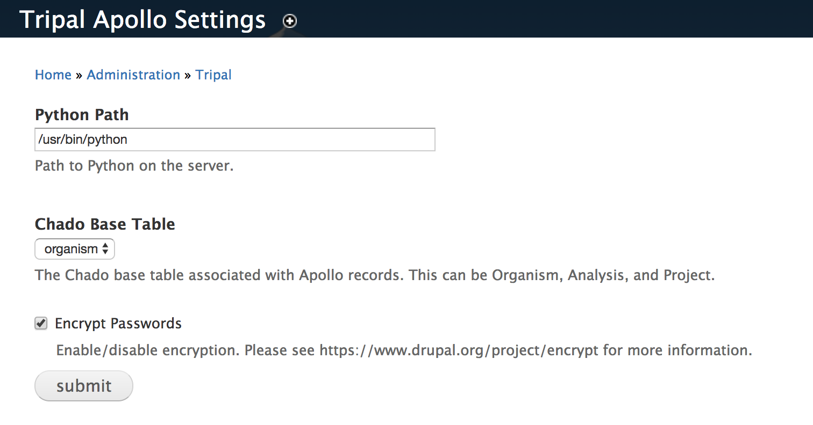
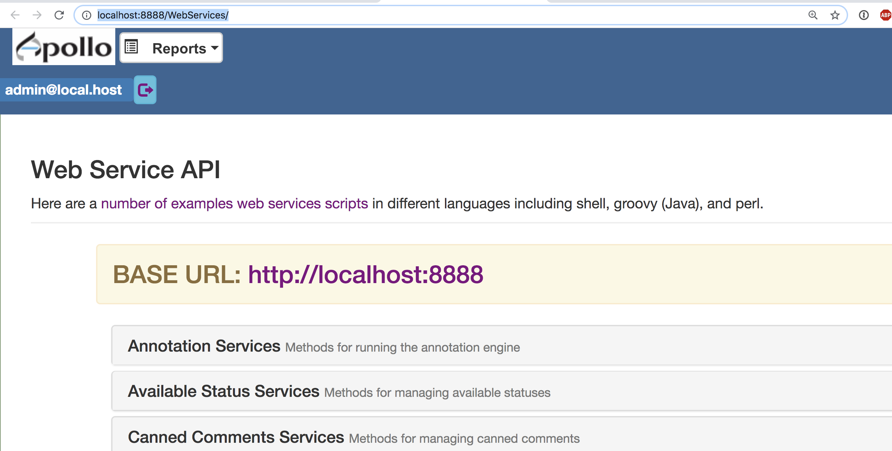
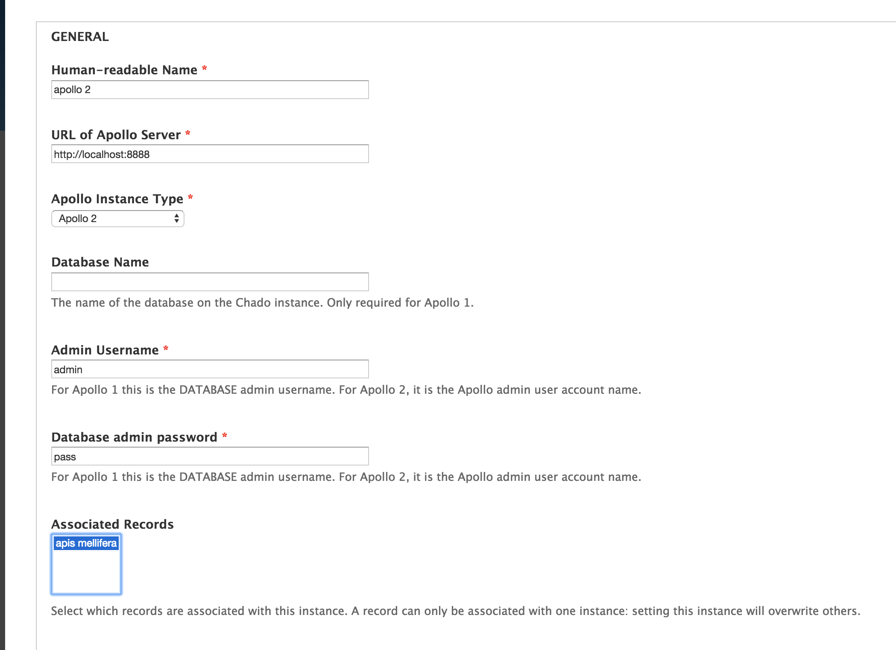

The Tripal Apollo module seeks to bridge Tripal and Apollo user and data management for both Apollo 1 and 2.

# What is Apollo?

Apollo is a plugin for the Genome Viewer [JBrowse](http://jbrowse.org/)

Apollo provides:

* A user interface for editing gene annotation tracks
* GO term support
* Revision history

To learn more, visit:

http://genomearchitect.github.io/

# What does Tripal Apollo do?

### User account requests

Users visit `/apollo-registration` and select which organisms they would like access to.

An email is sent to the user and the site admin email notifying them of the request.

### Approving/denying requests

Registration requests appear at `admin/tripal/apollo/users`.

Each row is for a single user - organism request pairing, so a single form submission may consist of several rows.  The admin can click the "edit" button to view the request, which will list the user name, email, organism.  To approve or reject the request, check the appropriate box and click **Save**.
.

# Admin setup

## Apollo 1 setup

Apollo 1 does not support a REST API.  Your Apollo 1 server's database must therefore be setup to accept remote connections by editing  `pg_hba.conf`.

## Site-wide settings

Site-wide settings can be set at `/admin/tripal_apollo`.  

Note that we encourage enabling encryption of passwords.  However, disabling encryption is provided in case of issues setting up the encryption module.

## Creating an Apollo Instance

First, you must tell the module about your Apollo server.  To do so, go to **Content --> add Content --> Apollo Instance**.

If your server is apollo 1, you will need to provide teh db name, db admin name and password.  Apollo 2 will instead require the admin username and password: the db username is not required.

The URL should be the full apollo server URL without a trailing slash, for example,  `http://localhost:8888`.  The correct URL is listed in your web services API on your apollo server:

Select all of the organisms you would like linked to this apollo instance.

## Permissions

This module defines the following permissions:

* administer tripal apollo: Administer the module itself.  This permission is for site admins.
* administer apollo users.  Allows admins to approve/deny apollo access requests.  This permission is for community leaders.
 * access apollo: allows users to make apollo registration requests.  You can give this permission to anonymous users, allowing users to register for apollo accounts without a Drupal account.

To learn more about setting up permissions and roles, please see https://www.drupal.org/docs/7/managing-users/user-roles

## References

Dunn NA, Munoz-Torres MC, Unni D, Yao E, Rasche E, Bretaudeau A, Holmes IH, Elsik CG; Lewis SE (2017). GMOD/Apollo: Apollo2.0.6(JB#29795a1bbb)
