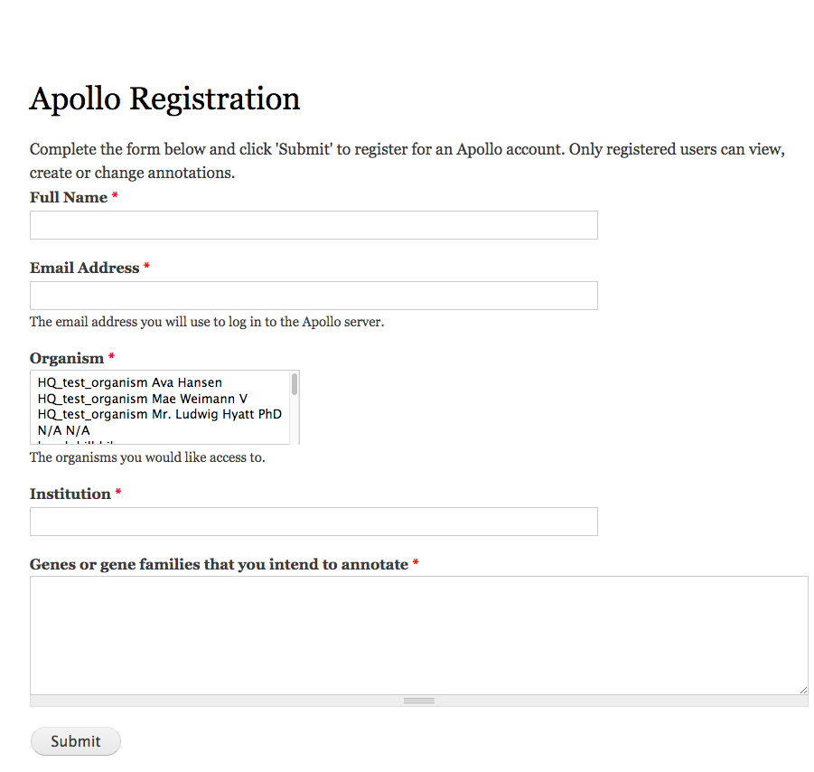
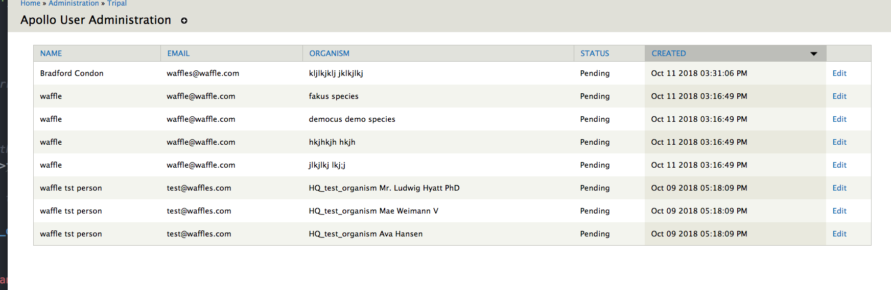
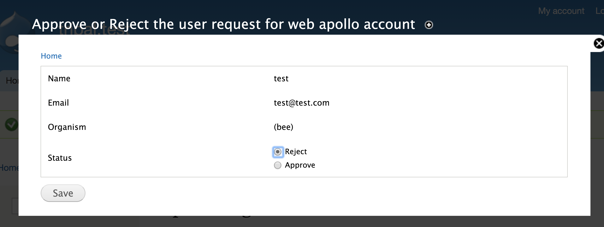

The Tripal Apollo module seeks to bridge Tripal and Apollo user and data management for both Apollo 1 and 2.

This module is under active development and is **not ready** for deployment.

# What is Apollo?

Apollo is a plugin for the Genome Viewer [JBrowse](http://jbrowse.org/)

Apollo provides:

* A user interface for editing gene annotation tracks
* GO term support
* Revision history

To learn more, visit:

http://genomearchitect.github.io/

# What does Tripal Apollo do?

### User account requests

Users visit `/apollo-registration` and select which organisms they would like access to.

An email is sent to the user and the site admin email notifying them of the request.

### Approving/denying requests

Registration requests appear at `admin/tripal/apollo/users`.

Each row is for a single user - organism request pairing, so a single form submission may consist of several rows.  The admin can click the "edit" button to view the request, which will list the user name, email, organism.  To approve or reject the request, check the appropriate box and click **Save**.

# Admin setup

## Creating an Apollo Instance

The URL should be the full location of your apollo instance, without a trailing slash.  For example:

http://localhost:8888

### Web Apollo one and two

There is a web apollo 1 and 2.  This module supports both instances at a base level.  However certain features are Apollo 2 only (organism syncing for example).

## References

Dunn NA, Munoz-Torres MC, Unni D, Yao E, Rasche E, Bretaudeau A, Holmes IH, Elsik CG; Lewis SE (2017). GMOD/Apollo: Apollo2.0.6(JB#29795a1bbb)
